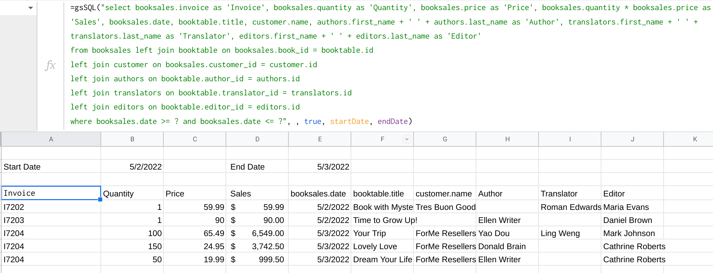

[](https://sonarcloud.io/summary/new_code?id=demmings_gsSQL)
[](https://sonarcloud.io/summary/new_code?id=demmings_gsSQL)
[](https://sonarcloud.io/summary/new_code?id=demmings_gsSQL)
[](https://sonarcloud.io/summary/new_code?id=demmings_gsSQL)
[](https://sonarcloud.io/summary/new_code?id=demmings_gsSQL)
[](https://sonarcloud.io/summary/new_code?id=demmings_gsSQL)
[](https://github.com/demmings/gsSQL/actions/workflows/codeql.yml)
[](https://deepsource.io/gh/demmings/gsSQL/?ref=repository-badge)
[](https://github.com/marketplace/actions/super-linter)
[](https://coveralls.io/github/demmings/gsSQL)

[](https://npmjs.org/package/@demmings/gssql)
[](https://badge.fury.io/js/@demmings%2Fgssql)


---

# About

<table>
<tr>
<td>
  
**gsSQL** is a **high-quality** custom function for _Google Sheets_ that aims to **provide standard SQL SELECT syntax** to quickly **filter and summarize data**, using any **sheet or range** as an SQL table.

Easy to learn and understand: the **SQL query** consists mainly of English statements, making it easy to write - rather than the cryptic syntax of the **Google Sheet QUERY** function.

</td>
</tr>
</table>


> **gsSQL** Demo of SELECT statement using JOIN and calculated fields.


---

# Usage

```=gsSQL( SelectSqlStatement, [TableDefinitions], [ColumnOutputFlag], [BindVariableData])```

1.  **SelectSqlStatement.**  (Required)
    * Only the **SELECT** statement is supported.
    * Most all common usage is supported (see below).  
    * The first row of the table MUST contain unique column titles (for field names).
      * To reference a field where the title contains spaces, just use the underscore in place of the space.
        * e.g.  Title = "Transaction Date", SELECT=```"SELECT transaction_date from master_transactions"```
    * If parameter 2 is to be omitted, the table must be a sheet name.  If the sheet name contains spaces, you must use single quotes around the table name within the select.
      * e.g.  ```select * from 'master transactions' where account = 'bank'```
    * Bind variables use the question mark as a placeholder.  There must be matching question marks to bind variable data - which is specified starting in parameter 4.  
      * e.g.  ```select * from transactions where transaction_date >= ? and transaction_date <= ?``` 
    * The PIVOT command is also supported.  The 'PIVOT field' if used is the last part of the statement.  It must be used in conjunction with 'group by'.
      * e.g.  ```select transaction_date, sum(gross), sum(amount) from mastertransactions where transaction_date >=  '01/01/2022' and transaction_date <= '05/19/2022' and expense_category in (select income from budgetCategories where income <> '') group by transaction_date pivot account```

2. **TableDefinitions**  (Optional) 
   * Defines each table referenced in **SELECT** statement.
   * If a table does not encompass an entire sheet or you need to specify a range for the data, a table definition is required.
   * The table definition is an Array of arrays.  Each inner array defines ONE table.
     * a) Table name - this is the table name referenced in the select. This is a logical table name which will associated with the data range.  It does not have to be the sheet name (string).
     * b) Range of data - the google range that contains the data with the first row containing titles (used as field names).  This is any valid Google Sheet range name (i.e. Sheet Name, A1 notation or named range), but it must be passed in as a **STRING** (string)
     * c) Cache seconds - (integer) number of seconds that data loaded from range is held in cache memory before another select of the same range would load again.
    * Use the CURLY bracket notations to create the double array of table definitions.  If two separate tables are used within your SELECT, the table specifications would be entered as follows.
        * **{{a, b, c}; {a, b, c}}**
        * e.g. ```gsSQL("select transaction_date, sum(gross), sum(amount) from mastertransactions where transaction_date >= '01/01/2022' and transaction_date <= '05/19/2022' and expense_category in (select income from budgetCategories where income <> '') group by transaction_date pivot account", {{"mastertransactions", "Master Transactions!$A$1:$I", 60};{"budgetCategories","budgetIncomeCategories", 3600}})```

    
3.  **ColumnOutputFlag**  (Optional)
    * Include column title in output or not. (true adds column titles, false omits the title row).
      * This example will include the title row on output.


4.  **BindVariableData**. (Optional) 
    * There should be one data item listed PER question mark in the SELECT statement.  Data for the variables can be literal data, cell references (A1 notation), and named fields.
    * Using the data from the GIF above, here is an example a date input and appropriate data selected.
    * The dates are stored in named ranges **startDate** and **endDate**.



---

# Usage Bonus (for all you GAS lovers)

1.  The Google **QUERY** is only available as a sheet function and it is not available for use for your javascript functions.

2.  The Sql.gs (Sql.js) contains the Sql() class.  This is what the gsSQL() custom function uses to implement the data selects.
    * Commands can be chained.

    * Sql() Methods
      * addTableData(table, data, cacheSeconds) 
        *  **table** name referenced in SQL statement.
        *  **data**  either a double array with column title in first row OR a string indicating a sheet range (named range or A1 notation).
        *  **cacheSeconds**  number of seconds that loaded table data will be available from the cache after the initial loading.  default=0.
      * enableColumnTitle(true) 
        *  true or false.  Output a column title (default is none or false)
      * addBindParameter(value)
        *  For every question mark (no quotes) in your SELECT statement, there needs to be a matching bind variable data.  Call this method as for as many question marks in the select are used - in the order that they are found.
        *  Do not use for named range data, in that case use the method **addBindNamedRangeParameter**  
      * addBindNamedRangeParameter(nameRange)
        *   For a bind variable that references a SINGLE cell named range.  Input is a STRING.  
      * execute(stmt)
        * stmt:  SQL SELECT statement to run.  
            Returns a double array of data (first row is column title - if enabled).

3.  Example usage:
   
```
let stmt = "select date, sum(quantity) from bookReturns where date >= ? and date <= ? group by date pivot customer_id";

let data = new Sql()
            .addTableData("bookReturns", this.bookReturnsTable())
            .enableColumnTitle(true)
            .addBindParameter("05/01/2022")
            .addBindParameter("05/04/2022")
            .execute(stmt);
```


---

# Installing


1.  Copy files manually.
    * There are **FIVE** required files:
      * SimpleParser.js
      * Sql.js
      * Table.js
      * TableData.js
      * Views.js
    * And the optional file
      * SqlTest.js
    * The simple approach is to copy and paste each file.
      * From your sheets Select **Extensions** and then **Apps Script**
      * Ensure that Editor is selected.  It is the **< >**
      * Click the PLUS sign beside **File** and then select **Script**
      * Find each file in turn in the **src** folder in the Github repository.
      * Click on a file, and then click on **Copy Raw Contents** which puts the file into your copy buffer.
      * Back in your Google Project, rename **Untitled** to the file name you just selected in Github.  It is not necessary to enter the .gs extension.
      * Remove the default contents of the file **myFunction()** and paste in the new content you have copied from Github (Ctrl-v).
      * Click the little diskette icon to save.
      * Continue with all five files until done.
      * Change to your spreadsheet screen and try typing in any cell
        * ```=gsSQL()```.  The new function with online help should be available.
  
2.  **clasp push**
    * Install the gsSQL source files locally.
      * Use ```npm install @demmings/gssql``` to install to node_modules folder.
        * I have included a sanity check after you have installed to your node_modules folder.  Look for "@demmings/gssql" folder and run ```npm test```
        * To find where your node_modules folder is just type ```npm root```
        * Please note that **gsSQL** is not really a node package since Google Sheets does not recognize this.  The use of **npm** to install is just a simple way to get the javascript to your local machine.
      * Clone the project from github repository to a local local.
        * In your existing local Google Sheet project, create a folder called **SQL** below your existing javascript source folder.
        * **clasp push** all your source files to Google.


---

# Supported SELECT syntax.
* All supported major keywords.
  * 'SELECT', 
  * 'FROM', 
  * 'JOIN', 
  * 'LEFT JOIN', 
  * 'RIGHT JOIN', 
  * 'INNER JOIN', 
  * 'FULL JOIN', 
  * 'ORDER BY', 
  * 'GROUP BY', 
  * 'HAVING', 
  * 'WHERE', 
  * 'LIMIT', 
  * 'UNION ALL', 
  * 'UNION', 
  * 'INTERSECT', 
  * 'EXCEPT', 
  * 'PIVOT'
* Supported **JOINS**
  * 'FULL JOIN'
  * 'RIGHT JOIN'
  * 'INNER JOIN'
  * 'LEFT JOIN'
* Supported **SET** commands.
  * 'UNION', 
  * 'UNION ALL', 
  * 'INTERSECT', 
  * 'EXCEPT'
* Aggregate Functions (group by)
  * "SUM", 
  * "MIN", 
  * "MAX", 
  * "COUNT", 
  * "AVG", 
  * "DISTINCT"
* SQL Server Functions
  * "ABS",
  * "CASE", 
  * "CEILING", 
  * "CHARINDEX", 
  * "FLOOR", 
  * "IF", 
  * "LEFT", 
  * "LEN", 
  * "LENGTH", 
  * "LOG", 
  * "LOG10", 
  * "LOWER",
  * "LTRIM", 
  * "NOW", 
  * "POWER", 
  * "RAND", 
  * "REPLICATE", 
  * "REVERSE", 
  * "RIGHT", 
  * "ROUND", 
  * "RTRIM",
  * "SPACE", 
  * "STUFF", 
  * "SUBSTRING", 
  * "SQRT", 
  * "TRIM", 
  * "UPPER"
* Logical Operators.
  *  '='
  *  '>'
  *  '<'
  *  '>='
  *  '<>'
  *  '!='
  *  'LIKE'
  *  'NOT LIKE'
  *  'IN'
  *  'NOT IN'
  *  'IS NOT'
  *  'IS'
        

# NOTES
1.  First ROW of data MUST be the column name.
2.  If the column includes spaces, the SELECT statement must replace the spaces with an underscore.  e.g.:  "First Name" is the column and the select would be "select first_name from myTable"
3.  Column names do not support the period ".", so you must remove periods before trying the select.
4.  Column names must be unique (obviously).
5.  When specifying the input table definitions, you should only specify tables referenced in the SELECT as all data from every table is loaded into memory for processing.
6.  When ***gsSQL*** is used within your sheet multiple times and the same tables are also referenced multiple times, it makes sense to specify a cache seconds value.  For tables that change often and up to date info is required, keep the cache either very low or zero.  However, for tables that rarely change, it makes sense to cache for a longer period.  
7.  The Google cache does have size and duration limits.  If the table is huge, it is probably best to set the cache size to zero.  Also note that the cache has a duration limit of 21600 seconds.  Beyond that number of saeconds, the script properties are used to store the data - which may not be as quick as the cache and the long term cache has **VERY** limited capacity.
8.  Use BIND variables to simplify the SELECT statement.  In the following statement, you must supply 3 bind variables  e.g.
9.  BIND variables simplify the use of date comparisons.  The QUERY statement requires that you format the date in your SELECT.  Any DATE BIND variables are converted automatically.  Just specify the named range or A1 range in your gsSQL statement (without quotes) for each parameter and in your SELECT, just substitute with a question mark.  

---

# Known Issues:

Most all SELECT functionality is implemented, however if you want to do anything extremely fancy, it may not to work.  Check out the SqlTest.js to get an idea of the kind of commands that will work.  


1)  Field alias syntax is not fully supported.  It is currently only used for column titles that can be returned with the select data.
            
2)  Moderate amount of error checking.  When developing your SQL SELECT statements and something is not correct or not supported, the application may just fail without giving any real indication of the problem.  This needs improvements (although it is much improved since the first version).

3)  Not really an issue, but the use of bind variables does not mean that the SELECT is compiled and reused.  It is only to make your SELECT easier to read.

